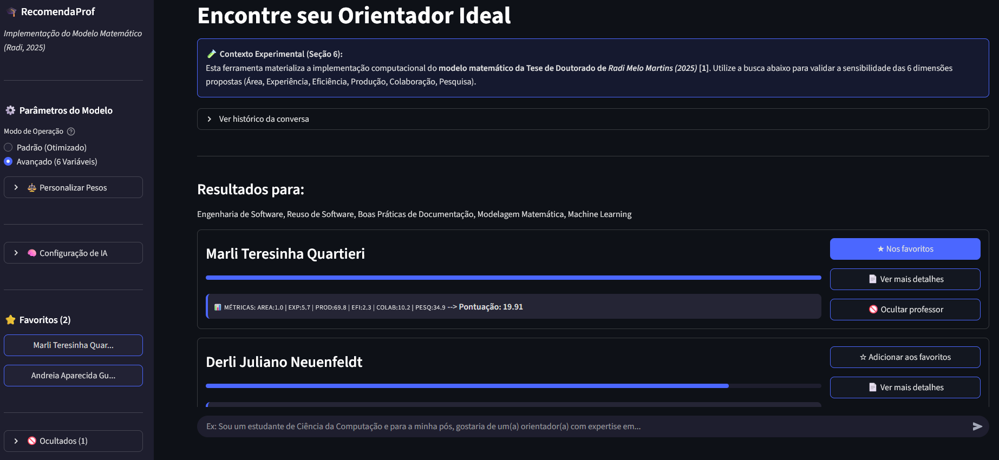
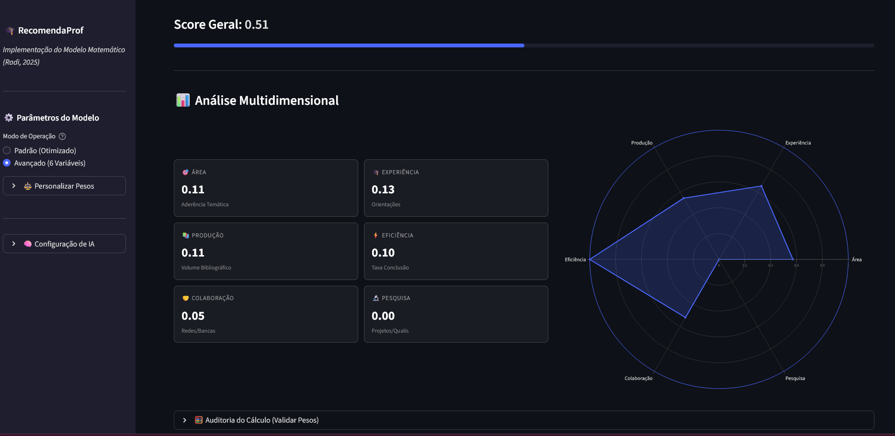
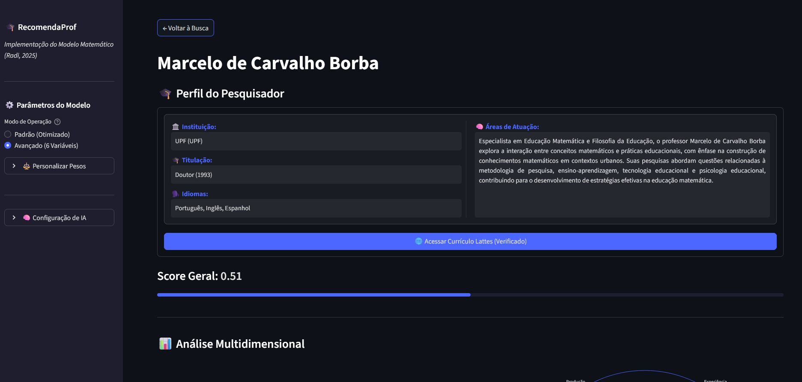
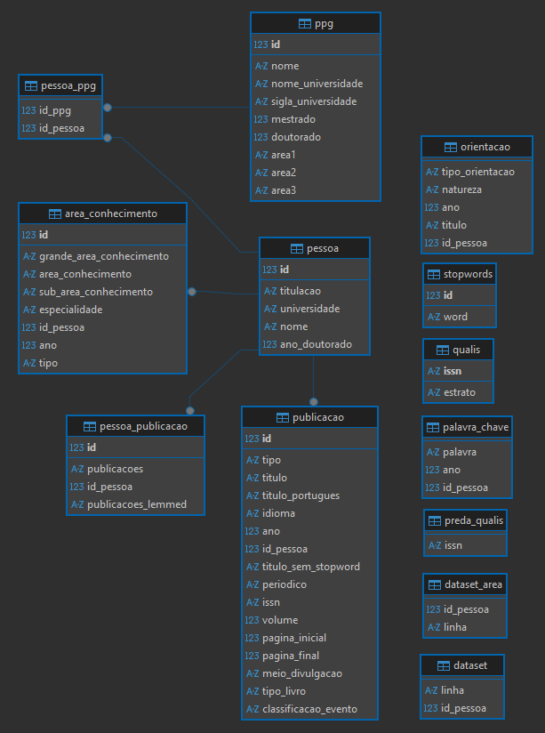

# 🎓 RecomendaProf

**RecomendaProf** é um sistema de **recomendação inteligente de orientadores de mestrado/doutorado** que auxilia estudantes de pós-graduação a encontrarem o orientador ideal. Diferente de buscas simples por palavras-chave, ele utiliza um **algoritmo híbrido** que combina:

1.  **Semântica:** Processamento de Linguagem Natural (NLP) e Clusterização para afinidade temática;
2.  **Métricas Acadêmicas:** Um modelo matemático com 6 dimensões (Produção, Experiência, Eficiência, etc.);
3.  **Inteligência Artificial Generativa:** Uso de LLMs (Gemini/Ollama) para explicar recomendações e resumir perfis.

---

## 💡 Visão Geral

O sistema utiliza dados extraídos do **Currículo Lattes**, além de métricas de impacto (DOI, Impact Factor, CiteScore).  

A aplicação foi reimplementada com **Streamlit** para interface gráfica, **SQLite** como banco de dados (para facilidade de distribuição) e integração com LLMs para refinamento de busca.

---

## 📸 Interface

### 1. Página de Pequisa


<details>
<summary>Clique para ver mais imagens</summary>

### 2. Painel de Métricas Multidimensionais
O sistema calcula e normaliza dados do Lattes para gerar um *Score Híbrido*. A visualização permite entender rapidamente os pontos fortes do orientador (ex: alta produção vs. alta disponibilidade para orientação).



---

### 3. Perfil Inteligente (Resumo via IA)
As informações cruas do banco de dados são processadas e, opcionalmente, refinadas por IA para gerar um resumo legível das áreas de atuação, eliminando a "sopa de letrinhas" de palavras-chave.



</details>

---

## 🧠 Como Funciona a Recomendação

A recomendação segue o pipeline definido na Tese, processando o *Score de Afinidade* ($IR$) através de 3 estágios:

1. **Filtragem e Clusterização (IA)**
   - O texto do projeto do aluno é refinado e lematizado;
   - Algoritmos (Birch/KMeans) filtram docentes no mesmo cluster semântico.

2. **Cálculo Multifatorial (6 variáveis)**
   - Para os candidatos filtrados, o sistema calcula scores normalizados em 6 dimensões:
      - 🎯 **Área ($P_{Area}$):** Aderência hierárquica (Grande Área > Área > Subárea).
      - 🎓 **Experiência ($P_{Exp}$):** Volume histórico de orientações (Mestrado/Doutorado).
      - ⚡ **Eficiência ($P_{Efi}$):** Taxa de conclusão e sucesso nas orientações.
      - 📚 **Produção ($P_{Prod}$):** Volume bibliográfico ponderado (Artigos, Livros).
      - 🤝 **Colaboração ($P_{Colab}$):** Redes de coautoria e participação em bancas.
      - 🔬 **Pesquisa ($P_{Pesq}$):** Envolvimento em projetos e qualidade (Qualis).


3. **Ranking Ponderado**
- O usuário pode ajustar os pesos ($\alpha$) de cada variável, permitindo buscas focadas (ex: "Quero alguém com muita produção", ou "Prefiro alguém com muita experiência em orientar").


---

## 🚀 Funcionalidades

- Extração e processamento de dados do Currículo Lattes;
- Chatbot Inteligente que refina a busca do aluno usando LLMs (Local ou Nuvem);
- Pesos Personalizáveis: O aluno define o que é mais importante (ex: focar em produção ou em experiência);
- Explicabilidade: Cada recomendação vem com uma justificativa gerada por IA;
- Sistema de Favoritos e Ocultação de candidatos;
- Banco de dados SQLite portátil, sem necessidade de instalação de servidores complexos.

---

## 🧩 Estrutura do Projeto

```bash
.
├── streamlit_app.py        # Interface principal em Streamlit  
├── requirements.txt        # Dependências do projeto
├── .gitignore              # Arquivo git que diz quais arquivos ignorar enviar para versionamento
├── data.zip                # Pasta com os dados, basta extrair
│
├── data/
│   └── base_recomendacao.db   # Aparecerá pós extração do ".zip", é um arquivo banco de dados SQLite com dados já inseridos
│
├── utils/
│   ├── db_utils.py             # Conexão e utilidades do banco SQLite
│   └── thesis_recommend.py    # Motor de recomendação (SQLite + k-means + clustering)
│
└── assets/
    ├── legacy-versions/    # Pasta com prints de versões mais antigas
    └── example.png         # Pasta para guardar prints de versões do projeto (facilita na hora de mostra-los no README)
```

---

## 💾 Estrutura de Dados
O projeto utiliza um banco de dados **SQLite** portável, estruturado para relacionar produções, orientações e áreas de conhecimento de forma eficiente.



---

## 🛠️ Tecnologias Utilizadas

- **Python 3.10+** — linguagem de programação;
- **Streamlit** — interface web interativa;
- **SQLite** — banco relacional principal;
- **spaCy** — processamento de linguagem natural;
- **Pandas** — manipulação de dados;
- **Scikit-learn** — cálculo de métricas e pontuações;
- **SQLite3** — conexão com SQLite.

---

## ⚙️ Instalação

```bash
git clone https://github.com/LuanVitorCD/GCA_ChatBotRecomendation.git
cd GCA_ChatBotRecomendation

python -m venv venv
source venv/bin/activate   # Linux/Mac
venv\Scripts\activate      # Windows
pip install -r requirements.txt

python -m spacy download pt_core_news_md
```

---

## ▶️ Execução

### Modo Real (SQLite)
1. Extraia a pasta zipada com o .db `data.zip`;
2. Configure na sidebar:
   - (se selecionado no provedor `Nuvem (Gemini)`) as credenciais de API Gemini que utilizará;
     
   

   - (se selecionado no provedor `Local (Ollama)`) qual o modelo LLM rodando no Ollama que utilizará.
     
   
   
3. Rode a aplicação:
   ```bash
   streamlit run streamlit_app.py
   ```
4. Digite um prompt com sua área e interesses (ex: “Graduado em Ciência da Computação com interesse em pós focando em Modelagem Matemática e Machine Learning”) e clique em **Recomendar**.

---

## 👩‍💻 Autoria

Desenvolvido como parte do grupo de pesquisa GCA (Grupo de Computação Aplicada).

A lógica do modelo da tese em **Scikit-learn** é fixa, enquanto os módulos auxiliares são reimplementados em Python para maior flexibilidade e integração moderna.
