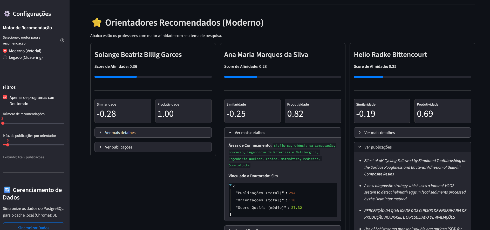

# 🎓 RecomendaProf

**RecomendaProf** é um sistema de **recomendação inteligente de orientadores de mestrado/doutorado**, desenvolvido em Python.  
Ele combina **busca semântica vetorial (ChromaDB)** com métricas de produtividade acadêmica, oferecendo recomendações equilibradas entre **afinidade temática** e **experiência científica**.

---

## 💡 Visão Geral

O sistema utiliza dados extraídos do **Currículo Lattes**, além de métricas de impacto (DOI, Impact Factor, CiteScore).  
A aplicação foi reimplementada com **Streamlit** para interface gráfica, **ChromaDB** como banco vetorial e integração com **PostgreSQL**.

---

## 🖼️ Imagem do projeto rodando


---

## 🧠 Como Funciona a Recomendação

O **Score de Afinidade** é calculado a partir de dois pilares:

1. **Busca Semântica (ChromaDB)**
   - O texto do projeto do aluno é convertido em um embedding vetorial.
   - O sistema identifica professores cujas publicações têm maior similaridade semântica.

2. **Produtividade Acadêmica**
   - Métricas como número de publicações, orientações e Qualis médio são normalizadas.
   - Gera-se um *score* de produtividade combinado com a similaridade semântica.

O resultado é um **Score Híbrido**, equilibrando relevância temática e produtividade científica.

---

## 🚀 Funcionalidades

- Extração automática de dados do **Currículo Lattes**.
- Criação de datasets a partir das informações processadas.
- Ranqueamento de professores por relevância.
- Chatbot interativo para consulta de orientadores.
- Sincronização entre **PostgreSQL** e **ChromaDB**.
- Alternância entre motores de recomendação:
  - `recommend_chroma.py` → moderno (busca vetorial)
  - `recommend_legacy.py` → legado (clustering)

---

## 🧩 Estrutura do Projeto

```bash
.
├── streamlit_app.py        # Interface principal em Streamlit
├── recommend_chroma.py     # Motor de recomendação moderno (ChromaDB)
├── recommend_legacy.py     # Motor legado (SQL + clustering)
├── chroma_utils.py         # Sincronização PostgreSQL → ChromaDB
├── db_utils.py             # Conexão e utilidades do banco PostgreSQL
├── requirements.txt        # Dependências do projeto
│
├── legacy/
│   ├── ingest.py
│   ├── dataset_generator.py
│   └── recommend.py
│
├── legacy_java/
│   ├── ProcessadorLattesCompleto.java
│   ├── ProcessadorQualis.java
│   └── GeradorDeDatasets.java
│
├── sql/
│   └── create_tables.sql   # Estrutura de tabelas no PostgreSQL
│
├── utils/
│   └── servidor-unificado.py   # Backend legado (Flask)
│
└── assets/
    └── exemplo.png
```

---

## 🛠️ Tecnologias Utilizadas

- **Python 3.10+**
- **Streamlit** — interface web interativa
- **ChromaDB** — banco vetorial para embeddings
- **PostgreSQL** — banco relacional principal
- **spaCy** — processamento de linguagem natural
- **Pandas** — manipulação de dados
- **Scikit-learn** — cálculo de métricas e pontuações
- **Psycopg2** — conexão com PostgreSQL

---

## ⚙️ Instalação

```bash
git clone https://github.com/LuanVitorCD/GCA_ChatBotRecomendation.git
cd GCA_ChatBotRecomendation

python -m venv venv
source venv/bin/activate   # Linux/Mac
venv\Scripts\activate      # Windows
pip install -r requirements.txt

python -m spacy download pt_core_news_md
```

---

## ▶️ Execução

### Modo Real (PostgreSQL + ChromaDB)
1. Crie as tabelas usando `sql/create_tables.sql`
2. Configure as credenciais no `db_utils.py`
3. Rode a aplicação:
   ```bash
   streamlit run streamlit_app.py
   ```
4. No app, use o menu lateral para **sincronizar PostgreSQL → ChromaDB**
5. Digite sua área de interesse (ex: “Visão Computacional”) e clique em **Recomendar**

---

## 👩‍💻 Autoria

Projeto de pesquisa em desenvolvimento contínuo.  
A lógica do modelo híbrido em **Scikit-learn** é fixa, enquanto os módulos auxiliares são reimplementados em Python para maior flexibilidade e integração moderna.
