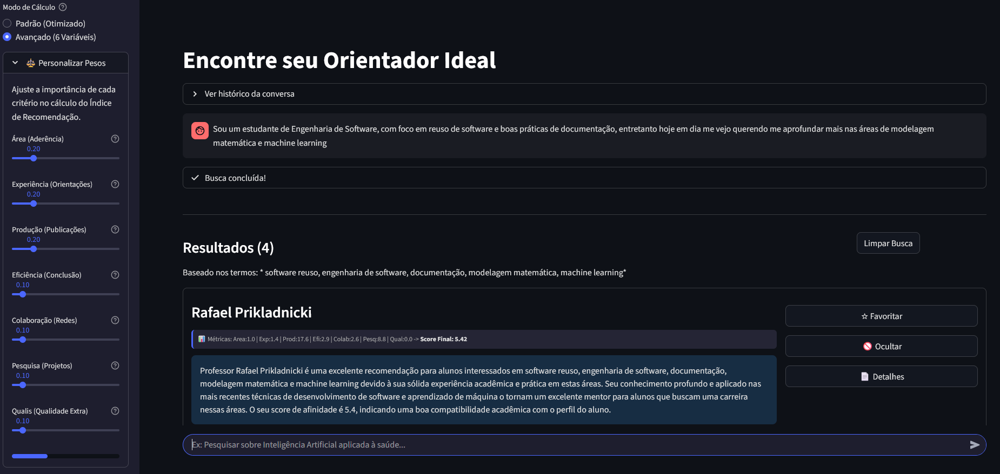
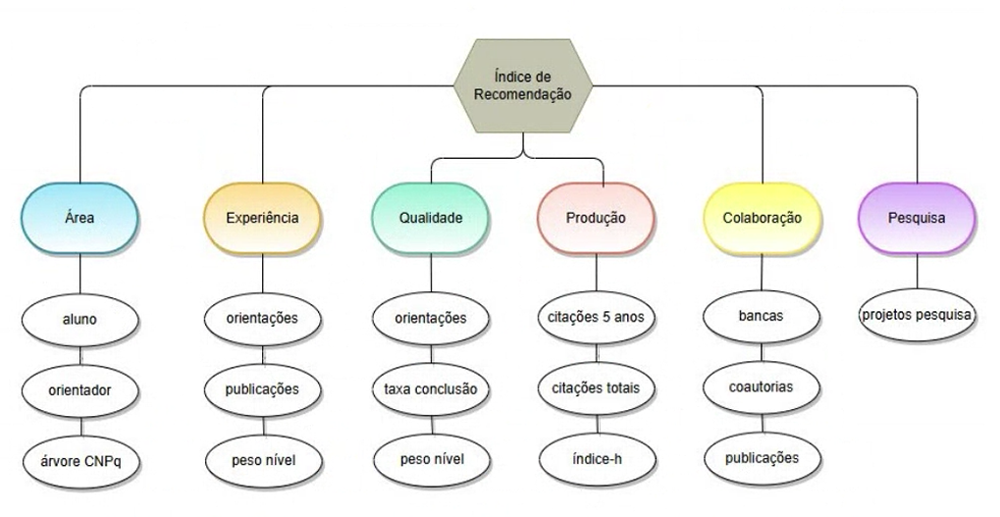
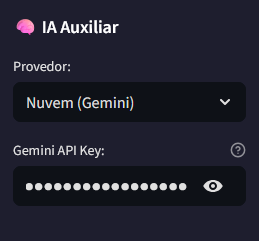
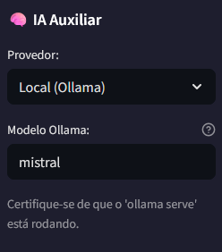

# 🎓 RecomendaProf

**RecomendaProf** é um sistema de **recomendação inteligente de orientadores de mestrado/doutorado**, desenvolvido em Python.  
Ele combina **busca semântica via clusterização** com métricas de produtividade acadêmica, oferecendo recomendações equilibradas entre **afinidade temática** e **experiência científica**.

---

## 💡 Visão Geral

O sistema utiliza dados extraídos do **Currículo Lattes**, além de métricas de impacto (DOI, Impact Factor, CiteScore).  
A aplicação foi reimplementada com **Streamlit** para interface gráfica, **SQLite** como banco de dados (para facilidade de distribuição) e integração com LLMs para refinamento de busca.

---

## 🖼️ Imagem do projeto rodando


---

## 🧠 Como Funciona a Recomendação

O **Score de Afinidade** é calculado a partir de um pipeline de 3 estágios:

1. **Filtragem e Clusterização (IA)**
   - O texto do projeto do aluno é refinado e lematizado;
   - Algoritmos de clustering (Birch e KMeans) agrupam docentes semanticamente alinhados à pesquisa.

2. **Cálculo Multifatorial (6 variáveis)**
   - Para os candidatos filtrados, o sistema calcula scores normalizados em 6 dimensões:
      - **Área** (Aderência temática);
      - **Experiência** (Volume de orientações);
      - **Eficiência** (Taxa de conclusão);
      - **Produção** (Volume bibliográfico);
      - **Colaboração** (Redes de coautoria/bancas);
      - **Pesquisa** (Projetos).



3. **Ranking Final**
- O Índice de Recomendação ($IR$) é a soma ponderada dessas variáveis, com pesos ajustáveis pelo usuário.


---

## 🚀 Funcionalidades

- Extração e processamento de dados do Currículo Lattes;
- Chatbot Inteligente que refina a busca do aluno usando LLMs (Local ou Nuvem);
- Pesos Personalizáveis: O aluno define o que é mais importante (ex: focar em produção ou em experiência);
- Explicabilidade: Cada recomendação vem com uma justificativa gerada por IA;
- Sistema de Favoritos e Ocultação de candidatos;
- Banco de dados SQLite portátil, sem necessidade de instalação de servidores complexos.

---

## 🧩 Estrutura do Projeto

```bash
.
├── streamlit_app.py        # Interface principal em Streamlit  
├── requirements.txt        # Dependências do projeto
├── .gitignore              # Arquivo git que diz quais arquivos ignorar enviar para versionamento
├── data.zip                # Pasta com os dados, basta extrair
│
├── data/
│   └── base_recomendacao.db   # Aparecerá pós extração do ".zip", é um arquivo banco de dados SQLite com dados já inseridos
│
├── utils/
│   ├──db_utils.py             # Conexão e utilidades do banco SQLite
│   └── thesis_recommend.py    # Motor de recomendação (SQLite + k-means + clustering)
│
└── assets/
    └── example.png         # Pasta para guardar prints de versões do projeto (facilita na hora de mostra-los no README)
```

---

## 🛠️ Tecnologias Utilizadas

- **Python 3.10+**
- **Streamlit** — interface web interativa
- **SQLite** — banco relacional principal
- **spaCy** — processamento de linguagem natural
- **Pandas** — manipulação de dados
- **Scikit-learn** — cálculo de métricas e pontuações
- **SQLite3** — conexão com SQLite

---

## ⚙️ Instalação

```bash
git clone https://github.com/LuanVitorCD/GCA_ChatBotRecomendation.git
cd GCA_ChatBotRecomendation

python -m venv venv
source venv/bin/activate   # Linux/Mac
venv\Scripts\activate      # Windows
pip install -r requirements.txt

python -m spacy download pt_core_news_md
```

---

## ▶️ Execução

### Modo Real (SQLite)
1. Extraia a pasta zipada com o .db `data.zip`;
2. Configure na sidebar:
   - (se selecionado no provedor `Nuvem (Gemini)`) as credenciais de API Gemini que utilizará;
   

   - (se selecionado no provedor `Local (Ollama)`) qual o modelo LLM rodando no Ollama que utilizará.
   
   
3. Rode a aplicação:
   ```bash
   streamlit run streamlit_app.py
   ```
4. Digite um prompt com sua área e interesses (ex: “Graduado em Ciência da Computação com interesse em pós focando em Modelagem Matemática e Machine Learning”) e clique em **Recomendar**.

---

## 👩‍💻 Autoria

Projeto de pesquisa em desenvolvimento contínuo.  
A lógica do modelo da tese em **Scikit-learn** é fixa, enquanto os módulos auxiliares são reimplementados em Python para maior flexibilidade e integração moderna.
